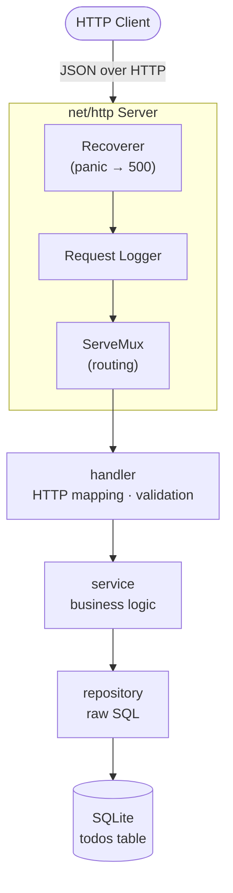
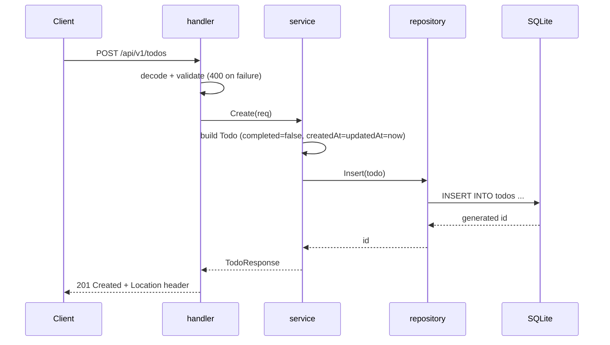
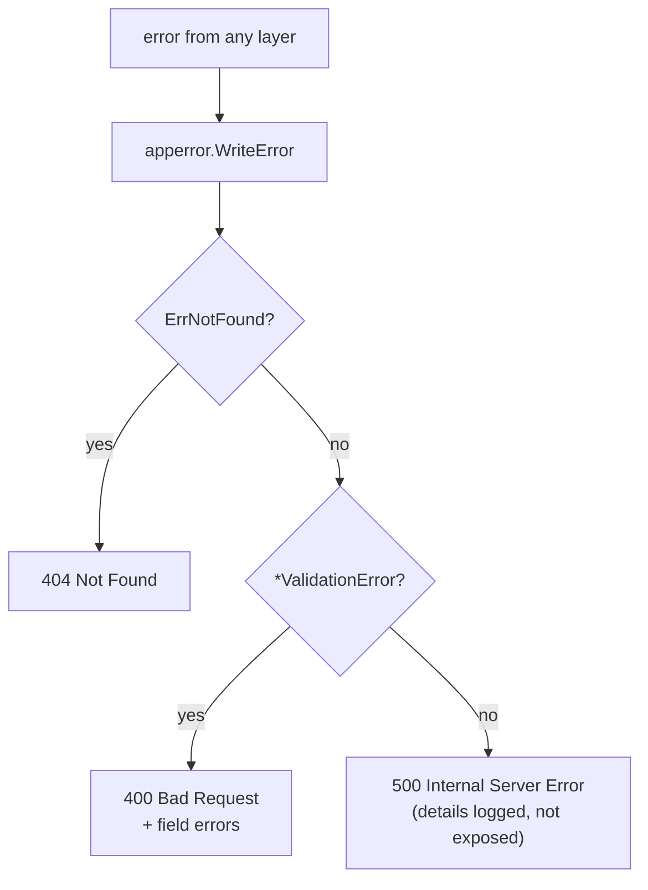

# Architecture

`todo-app-go` is a small REST API for managing todos, built on the Go standard library alone (the only external dependency is the SQLite driver) — no web framework, ORM, or DI container.

## Layers

Requests flow one-way, top to bottom: `handler → service → repository`.



| Layer | Responsibility |
|---|---|
| `handler` | HTTP mapping, request validation, status codes |
| `service` | business logic, existence checks, entity ↔ DTO conversion |
| `repository` | executes SQL |

Each layer defines the interface it needs from the layer below (Go convention: consumer declares the interface, not the implementer). 
All concrete types are created once, in `cmd/todoapp/main.go`, and passed down via constructors — this is also what makes each layer easy to test with a small fake, no mocking library needed.

## Request lifecycle

Example: creating a todo.



Reads follow the same path minus the write step.
`PATCH`/`DELETE` add an existence check in `service`, returning a "not found" error if the todo is missing.

## Error handling

No framework-level exception handler — every error passes through one function, `apperror.WriteError`, which converts it to an `application/problem+json` response (e.g. `{"status": 404, "detail": "Todo not found: 1", ...}`):



## Cross-cutting concerns

| Concern | Mechanism |
|---|---|
| Structured logging | `log/slog`, JSON output, injected (not global) |
| Panic recovery | `Recoverer` middleware — recovers, logs, returns 500 |
| Graceful shutdown | `signal.NotifyContext` + `http.Server.Shutdown` (10s drain) |
| DB concurrency | single connection + SQLite `busy_timeout`/WAL pragmas |

## Package layout

```
todo-app-go/
├── cmd/todoapp/main.go   # composition root: wiring + startup
└── internal/
    ├── handler/          # HTTP mapping
    ├── middleware/       # request logging, panic recovery
    ├── service/          # use cases
    ├── repository/       # SQL execution
    ├── model/            # domain entity (Todo)
    ├── dto/              # request/response structs + validation
    ├── apperror/         # error types + problem+json conversion
    └── clock/            # time source abstraction
```

## Tech stack

| Area | Choice |
|---|---|
| Language | Go 1.26 |
| HTTP | `net/http` (`ServeMux` method + path routing) |
| Database | SQLite via `modernc.org/sqlite` (pure Go, no CGO) |
| DB access | `database/sql` + raw SQL (no ORM) |
| Validation | hand-written functions |
| Logging | `log/slog` (JSON) |
